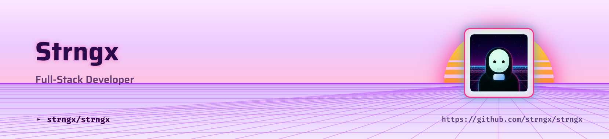

  <picture>
    <source media="(prefers-color-scheme: dark)" srcset="header-dark.png">
    <source media="(prefers-color-scheme: light)" srcset="header-light.png">
    
  </picture>

<h1 align="center">
  Hey there, I'm Arjun 👋
</h1>

  
  
  

<h2 align="center">👨‍💻 About Me</h2>

<table align="center">
<tr>

<td width="65%" valign="top">

- 💻 Full Stack Developer passionate about building modern web apps.
- 🌱 Currently learning System Design, Cloud & DevOps.
- 🚀 Building AI-powered projects and contributing to Open Source.
- 🎯 Goal: Create products that solve real-world problems.
- 🌌 Passionate about AI, music, impactful builds, and exploring the internet.
- ✨ Always chasing the next idea worth building.
</td>

<td width="35%" align="center" valign="middle">

</td>

</tr>
</table>

<h2 align="center">💻 Tech Stack</h2>

<h2 align="center">📈 GitHub Analytics</h2>

<h2 align="center"> 🐍 Contribution Graph </h2>

  <picture>
    <source media="(prefers-color-scheme: dark)" srcset="https://raw.githubusercontent.com/arjunkhatriofficial/arjunkhatriofficial/output/github-contribution-grid-snake-dark.svg">
    <source media="(prefers-color-scheme: light)" srcset="https://raw.githubusercontent.com/arjunkhatriofficial/arjunkhatriofficial/output/github-contribution-grid-snake.svg">
    
  </picture>

<h2 align="center">🌐 Let's Connect</h2>

See you in the next commit 🚀

